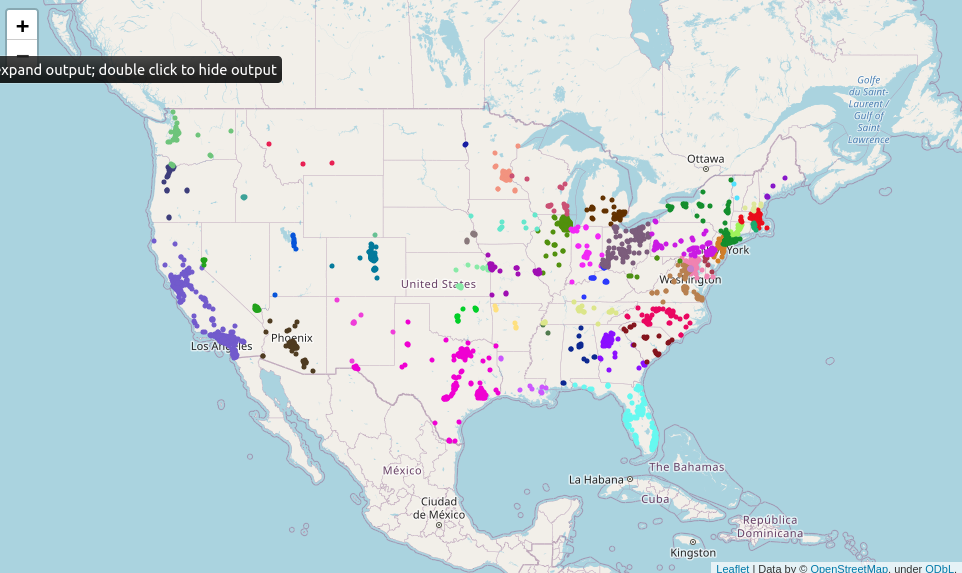
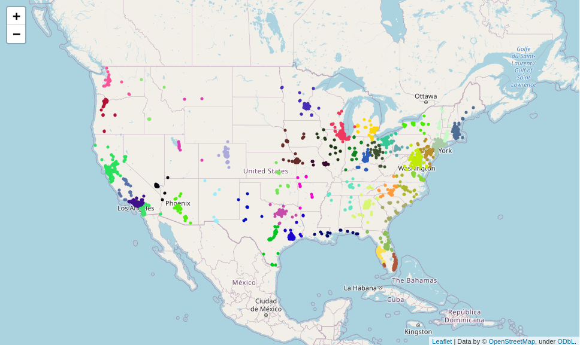
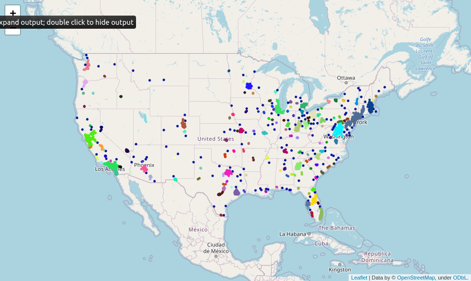
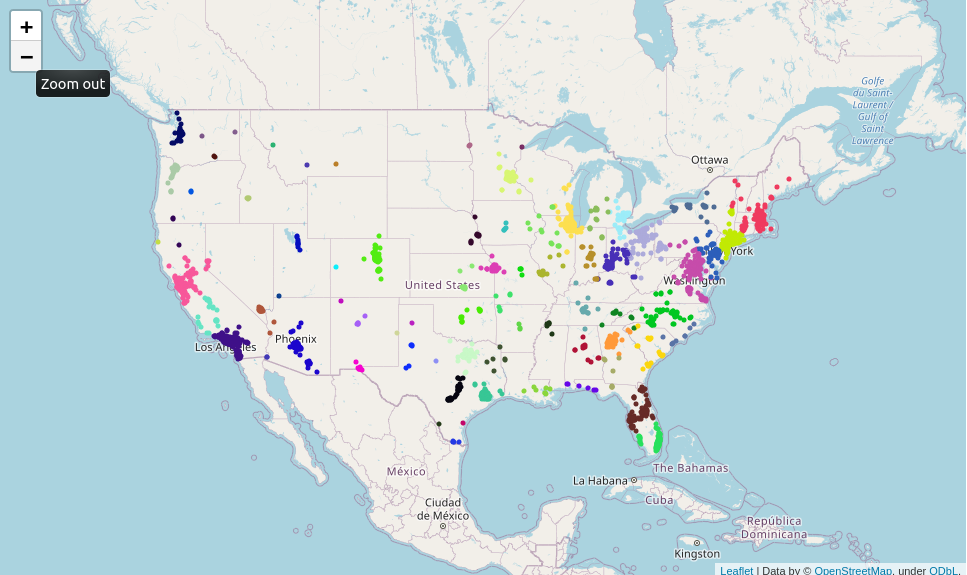
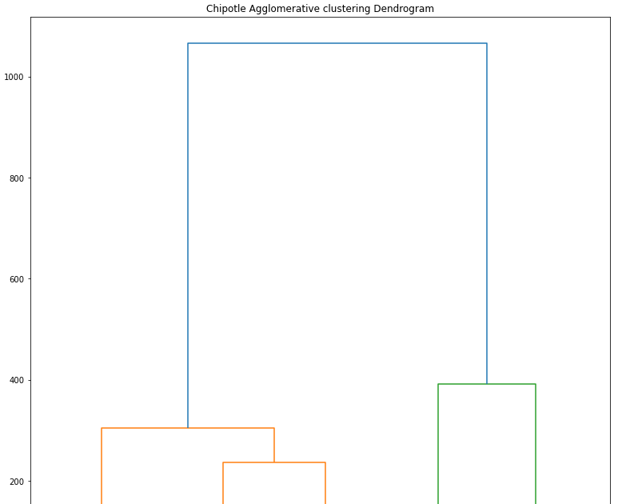

# Chipotle clustering challenge

## The Mission

>"Honey, where do you wanna eat?"
>
>"Do you even have to ask? Chipotle, of course!"
>
>"How could I forget, we've been eating chipotle for the last 47 days..."
>
>"So get ready for number 48! Oh I can't wait to stuff my face with a burrito!"
>
>"But the closest one is an hour drive away, couldn't we just get mcdonalds?"
>
>"How dare you utter that word in my presence? First the neighbours, now you!"
>
>"The neighbours? What do they have to d-"
>
>"That's it, we're moving, I can't deal with this anti-chipotle fascism."

Find chipotle **epicentres** to live your ideal chipotle lifestyle by clustering the [chipotle](https://github.com/MDropsy/Chipotle/blob/master/Datas/chipotle_stores.csv) dataset.

## The map 

Map plot using folium and the chipotle location dataset , the position of each Chipotle by state : 

## Clustering algorithms

#### KMeans

#### DBSCAN

#### Mean-Shift

## Dendogram
Dendogram plot to help choosing in wich cluster to live if you want to test the most Chipotle without moving far away.

